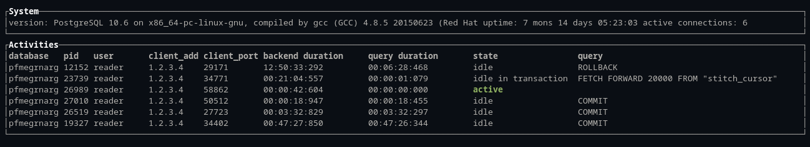

    ________ ________________________ ________
    ___  __ \__  ____/___  __/__  __ \___  __ \
    __  /_/ /_  / __  __  /   _  / / /__  /_/ /
    _  ____/ / /_/ /  _  /    / /_/ / _  ____/
    /_/      \____/   /_/     \____/  /_/
# pgtop #
Postgres database interactive process viewer, showing information related to the current database activity,
such as state and current query.
The information displayed is configurable through a graphical setup and can be sorted and filtered interactively.
Tasks related to processes (e.g. killing) can be done without entering their PIDs.

Built on top of the [pg_stat_activity view](https://www.postgresql.org/docs/9.4/monitoring-stats.html#PG-STAT-ACTIVITY-VIEW).